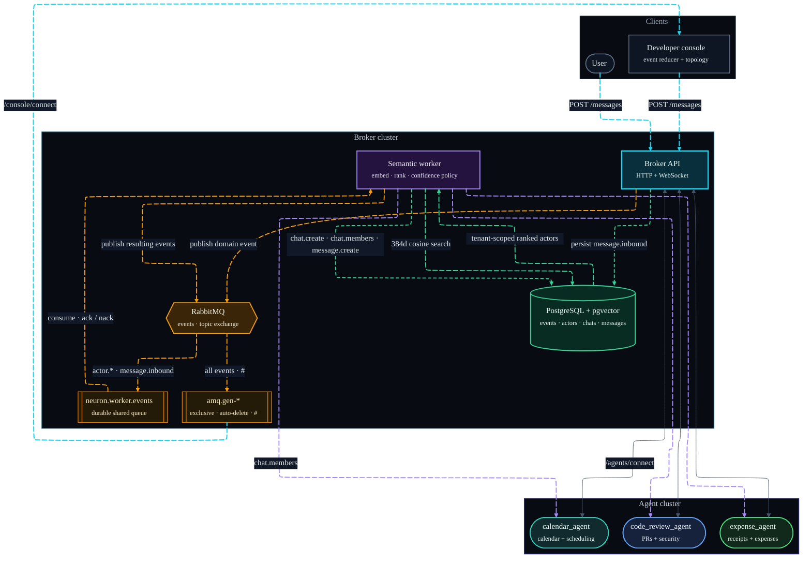

```mermaid
%%{init: {"theme":"base","layout":"elk","themeVariables":{"background":"#070a0f","primaryColor":"#0b1220","primaryTextColor":"#e6edf3","primaryBorderColor":"#334155","lineColor":"#475569","secondaryColor":"#111827","tertiaryColor":"#090d14","clusterBkg":"#090d14","clusterBorder":"#1f2937","fontFamily":"Inter, ui-sans-serif, system-ui, sans-serif"},"flowchart":{"curve":"basis","htmlLabels":true,"nodeSpacing":42,"rankSpacing":62}}}%%
flowchart TB
    subgraph clients["Clients"]
        direction LR
        user(["User"])
        console["Developer console<br/><small>event reducer + topology</small>"]
    end

    subgraph broker_cluster["Broker cluster"]
        direction TB
        broker["Broker API<br/><small>HTTP + WebSocket</small>"]
        postgres[("PostgreSQL + pgvector<br/><small>events · actors · chats · messages</small>")]
        exchange{{"RabbitMQ<br/><small>events · topic exchange</small>"}}
        worker_queue[["neuron.worker.events<br/><small>durable shared queue</small>"]]
        console_queue[["amq.gen-*<br/><small>exclusive · auto-delete · #</small>"]]
        worker["Semantic worker<br/><small>embed · rank · confidence policy</small>"]
    end

    subgraph agent_cluster["Agent cluster"]
        direction LR
        calendar(["calendar_agent<br/><small>calendar + scheduling</small>"])
        expense(["expense_agent<br/><small>receipts + expenses</small>"])
        review(["code_review_agent<br/><small>PRs + security</small>"])
    end

    user ingress_user@-->|"POST /messages"| broker
    console ingress_console@-->|"POST /messages"| broker

    broker persist_inbound@-->|"persist message.inbound"| postgres
    broker publish_inbound@-->|"publish domain event"| exchange

    exchange fanout_worker@-->|"actor.* · message.inbound"| worker_queue
    exchange fanout_console@-->|"all events · #"| console_queue
    console_queue stream_console@-->|"/console/connect"| console

    worker_queue consume_worker@-->|"consume · ack / nack"| worker
    worker vector_search@-->|"384d cosine search"| postgres
    postgres ranked_agents@-->|"tenant-scoped ranked actors"| worker
    worker persist_routing@-->|"chat.create · chat.members · message.create"| postgres
    worker publish_routing@-->|"publish resulting events"| exchange

    broker <-->|"/agents/connect"| calendar
    broker <--> expense
    broker <--> review

    worker route_calendar@-.->|"chat.members"| calendar
    worker route_expense@-.-> expense
    worker route_review@-.-> review

    ingress_user@{ animation: fast }
    ingress_console@{ animation: fast }
    publish_inbound@{ animation: fast }
    fanout_worker@{ animation: slow }
    fanout_console@{ animation: slow }
    stream_console@{ animation: slow }
    consume_worker@{ animation: fast }
    vector_search@{ animation: slow }
    ranked_agents@{ animation: slow }
    publish_routing@{ animation: fast }
    route_calendar@{ animation: slow }
    route_expense@{ animation: slow }
    route_review@{ animation: slow }

    classDef client fill:#0d1622,stroke:#64748b,color:#e6edf3,stroke-width:1.5px;
    classDef broker fill:#082f3b,stroke:#22d3ee,color:#ecfeff,stroke-width:2.5px;
    classDef database fill:#082b22,stroke:#34d399,color:#ecfdf5,stroke-width:2px;
    classDef rabbit fill:#3a2508,stroke:#f59e0b,color:#fffbeb,stroke-width:2px;
    classDef queue fill:#241a08,stroke:#d97706,color:#fef3c7,stroke-width:1.5px;
    classDef worker fill:#25133f,stroke:#a78bfa,color:#f5f3ff,stroke-width:2px;
    classDef calendar fill:#102a2d,stroke:#2dd4bf,color:#f0fdfa,stroke-width:1.75px;
    classDef expense fill:#10291b,stroke:#4ade80,color:#f0fdf4,stroke-width:1.75px;
    classDef review fill:#16213b,stroke:#60a5fa,color:#eff6ff,stroke-width:1.75px;
    classDef dataEdge fill:none,stroke:#34d399,stroke-width:2px,stroke-dasharray:7\,4;
    classDef eventEdge fill:none,stroke:#f59e0b,stroke-width:2px,stroke-dasharray:7\,4;
    classDef liveEdge fill:none,stroke:#22d3ee,stroke-width:2.25px,stroke-dasharray:6\,4;
    classDef routeEdge fill:none,stroke:#a78bfa,stroke-width:2px,stroke-dasharray:4\,5;

    class user,console client;
    class broker broker;
    class postgres database;
    class exchange rabbit;
    class worker_queue,console_queue queue;
    class worker worker;
    class calendar calendar;
    class expense expense;
    class review review;

    class persist_inbound,vector_search,ranked_agents,persist_routing dataEdge;
    class publish_inbound,fanout_worker,fanout_console,consume_worker,publish_routing eventEdge;
    class ingress_user,ingress_console,stream_console liveEdge;
    class route_calendar,route_expense,route_review routeEdge;

    style clients fill:#080c12,stroke:#1f2937,stroke-width:1px,color:#94a3b8
    style broker_cluster fill:#080c12,stroke:#164e63,stroke-width:1.5px,color:#cbd5e1
    style agent_cluster fill:#080c12,stroke:#312e81,stroke-width:1.5px,color:#cbd5e1
```
