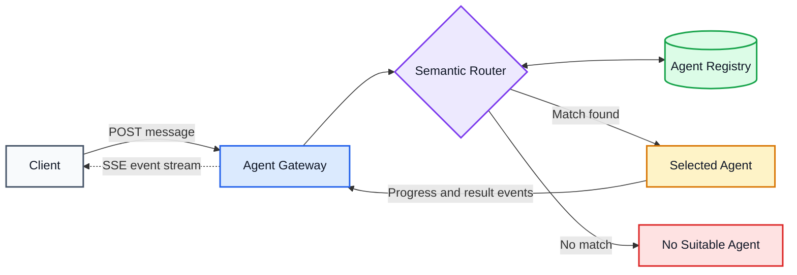

# Agent Gateway

A semantic gateway, router, and message broker for AI agents.

Agent Gateway accepts requests from clients, identifies the most appropriate registered agent based on message content and agent capabilities, forwards the request, and streams progress and results back to the client using Server-Sent Events.

## Architecture



## How It Works

1. A client submits a message to the gateway.
2. The gateway validates the request and passes it to the semantic router.
3. The router queries the agent registry for eligible agents.
4. Registered agents are ranked based on their capabilities and the message content.
5. The gateway forwards the request to the highest-ranked suitable agent.
6. The agent publishes progress and result events to the gateway.
7. The gateway streams those events to the client over SSE.
8. When no suitable agent exists, the gateway returns a no-route result.

## Features

- Semantic agent discovery
- Capability-based routing
- Explicit no-route decisions
- Agent registration and health tracking
- Task and chat correlation
- Server-Sent Events for client streaming
- Progress, result, failure, and cancellation events
- Durable message and task state
- Retry and failure handling
- Tenant-aware authorization and routing policies
- Support for synchronous and asynchronous agents

## Core Components

### Agent Gateway

The Agent Gateway is the public entry point for clients and agents.

It is responsible for:

- Authentication and authorization
- Message validation
- Task creation and persistence
- Routing orchestration
- Agent dispatch
- SSE connection management
- Event forwarding
- Cancellation
- Retry and failure handling

### Semantic Router

The Semantic Router selects the agent best suited to handle a request.

Routing considers:

- Message content
- Agent descriptions
- Registered skills
- Supported input and output types
- Input schema compatibility
- Required permissions
- Tenant boundaries
- Agent health
- Agent availability
- Current agent load
- Historical execution performance
- Semantic similarity

The router can return a no-route decision when no registered agent satisfies the request.

### Agent Registry

The Agent Registry is the directory of agents available to the gateway.

Each registration describes the agent, its capabilities, and how the gateway communicates with it.

```json
{
  "id": "agent_calendar",
  "name": "Calendar Agent",
  "description": "Manages calendars, availability, and meeting scheduling.",
  "skills": [
    {
      "name": "check_availability",
      "description": "Finds available time slots across one or more calendars."
    },
    {
      "name": "schedule_meeting",
      "description": "Creates calendar events for selected participants."
    }
  ],
  "transport": {
    "type": "http",
    "endpoint": "https://agent.example.com/tasks"
  },
  "status": "online"
}
```

Agent registrations contain:

- Agent identity
- Name and description
- Skills and capabilities
- Example requests
- Supported modalities
- Input and output schemas
- Transport configuration
- Agent endpoint or active connection
- Health and availability
- Authentication metadata
- Tenant and policy metadata
- Semantic skill embeddings

### Selected Agent

The selected agent receives and executes a task.

```json
{
  "task_id": "task_01J...",
  "correlation_id": "corr_01J...",
  "chat_id": "chat_01J...",
  "payload": {
    "message": "Schedule a meeting with Alice tomorrow afternoon."
  }
}
```

Agents publish lifecycle events while processing a task:

- `accepted`
- `started`
- `progress`
- `message`
- `completed`
- `failed`
- `cancelled`

## Client API

### Submit a Message

```http
POST /messages
Content-Type: application/json
```

```json
{
  "message": "Find an available time for my team tomorrow.",
  "chat_id": "chat_01J..."
}
```

Response:

```json
{
  "task_id": "task_01J...",
  "chat_id": "chat_01J...",
  "status": "routing"
}
```

### Stream Task Events

```http
GET /tasks/task_01J.../events
Accept: text/event-stream
```

Example stream:

```text
event: routed
data: {"task_id":"task_01J...","agent_id":"agent_calendar"}

event: progress
data: {"task_id":"task_01J...","message":"Checking attendee availability"}

event: completed
data: {"task_id":"task_01J...","result":{"start":"2026-07-20T15:00:00-04:00"}}
```

SSE provides the gateway-to-client event stream. Client commands are sent through HTTP endpoints.

### Get Task State

```http
GET /tasks/{task_id}
```

### Cancel a Task

```http
POST /tasks/{task_id}/cancel
```

## Agent API

### Register an Agent

```http
POST /agents
Content-Type: application/json
```

```json
{
  "id": "agent_calendar",
  "name": "Calendar Agent",
  "description": "Manages calendars, availability, and meeting scheduling.",
  "skills": [
    {
      "name": "check_availability",
      "description": "Finds available time slots."
    },
    {
      "name": "schedule_meeting",
      "description": "Creates calendar events."
    }
  ],
  "transport": {
    "type": "http",
    "endpoint": "https://agent.example.com/tasks"
  }
}
```

### Receive a Task

The gateway dispatches selected tasks to the agent:

```http
POST /agents/{agent_id}/tasks
Content-Type: application/json
```

### Publish a Task Event

```http
POST /tasks/{task_id}/events
Content-Type: application/json
```

```json
{
  "type": "progress",
  "payload": {
    "message": "Searching available time slots"
  }
}
```

### Report Agent Health

```http
POST /agents/{agent_id}/heartbeat
Content-Type: application/json
```

```json
{
  "status": "online",
  "active_tasks": 3
}
```

## Routing

Routing is performed as a multi-stage pipeline:

```text
Message
  -> eligibility filtering
  -> candidate retrieval
  -> semantic ranking
  -> policy evaluation
  -> agent selection
```

### Eligibility Filtering

Agents are removed from consideration when they fail hard requirements such as:

- Input schema compatibility
- Required permissions
- Tenant access
- Supported modality
- Agent health
- Agent availability
- Routing policy

### Candidate Retrieval

Eligible agents are retrieved using their registered descriptions, skills, tags, examples, and semantic embeddings.

### Ranking

Candidates are ranked using a combination of:

- Semantic similarity
- Skill relevance
- Schema compatibility
- Agent availability
- Current load
- Historical success
- Routing policy

### No-Route Decisions

The router returns a no-route result when no agent meets the configured eligibility or confidence requirements.

```json
{
  "task_id": "task_01J...",
  "status": "unroutable",
  "reason": "No registered agent supports the requested capability."
}
```

## Chat Routing

A chat can remain associated with its selected agent:

```text
chat_id -> agent_id
```

Subsequent messages are routed to the existing agent while the binding remains valid.

The gateway can reevaluate the chat binding when:

- The agent becomes unavailable
- The requested capability changes
- The client requests rerouting
- A routing policy requires reevaluation
- The agent delegates the task

## Message Delivery

The gateway remains between the client and the selected agent.

Clients do not require direct network access to agents, and agents do not require direct access to clients.

This allows the gateway to enforce:

- Authentication
- Authorization
- Auditing
- Rate limits
- Retry policies
- Cancellation
- Agent failover
- Tenant isolation
- Event persistence
- Chat affinity

### AMQP Topic Topology

Events are published to the durable `events` topic exchange with concrete two-part routing keys such as
`actor.create`. The worker consumes the shared durable `neuron.worker.events` queue, which is bound to
`actor.*` and `message.inbound`. Multiple worker replicas consume the same queue and therefore load-balance
deliveries.

Existing development brokers may still contain the old direct exchange and one queue per routing key. A direct
exchange cannot be redeclared as a topic exchange, so reset only that AMQP topology during coordinated downtime:

1. Stop publishers and consumers with `docker compose stop broker worker`.
2. Inspect the RabbitMQ management UI at `http://localhost:15672` and drain or explicitly discard messages in
   `actor.create`, `actor.update`, `message.create`, and `message.inbound`.
3. Delete those four queues and the `events` exchange in the management UI.
4. Start the consumer first with `docker compose up -d worker` and verify that `events` is a topic exchange with
   the `neuron.worker.events` queue and both expected bindings.
5. Resume publishing with `docker compose up -d broker`.

Do not use `docker compose down -v` for this migration because it can remove unrelated persisted data.

### Development Event Console

The broker can expose a tenant-scoped development console at `http://localhost:8080/console`:

```text
CONSOLE_ENABLED=true
CONSOLE_TENANT_ID=775a179d-9819-42c0-ab47-637bf96fbf7b
```

`CONSOLE_TENANT_ID` is required when the console is enabled. The development Compose override enables it for
the fixture tenant. The console replays persisted events and follows broker-enqueued events through an
in-process broadcast; the browser reduces those raw domain events into traces, agent presence, metadata, and
topology. Resetting local console state clears only its IndexedDB event cache.

Agent WebSocket clients should authenticate with `X-Agent-Id` and `X-Agent-Secret` headers. When both headers
are absent, `/agents/connect` accepts browser-compatible `agent_id` and `secret` query parameters. Complete
headers always take precedence, and a partial header pair is rejected instead of being combined with query
credentials.

The secret is never included in persisted actor events. The console stores a user-entered secret only in
browser `sessionStorage`; query credentials may remain visible in browser networking tools but are never
included in broker tracing output.

The broker uses the same compact tracing setup as the worker. Set `RUST_LOG` to override its default
`broker=debug` filter, for example `RUST_LOG=broker=info,storage=warn`.

Compose starts a new conversation. Messages sent from Live Chat include the established `chat_id`; the broker
accepts them only from existing chat members in the configured tenant, and the worker appends them without
rerunning agent selection or creating another chat.

## Task Model

Tasks have a stable identity and lifecycle.

```json
{
  "id": "task_01J...",
  "correlation_id": "corr_01J...",
  "chat_id": "chat_01J...",
  "client_id": "client_01J...",
  "agent_id": "agent_calendar",
  "status": "running",
  "created_at": "2026-07-17T14:00:00Z",
  "updated_at": "2026-07-17T14:00:03Z"
}
```

Task states include:

```text
pending
routing
dispatched
accepted
running
completed
failed
cancelled
unroutable
```

## Event Model

Every task event includes its task identity, event type, timestamp, and payload.

```json
{
  "id": "event_01J...",
  "task_id": "task_01J...",
  "type": "progress",
  "timestamp": "2026-07-17T14:00:03Z",
  "payload": {
    "message": "Checking attendee availability"
  }
}
```

Events are persisted before being streamed to connected clients, allowing clients to reconnect without losing task progress.

## API Overview

### Agents

```http
POST   /agents
GET    /agents
GET    /agents/{agent_id}
PUT    /agents/{agent_id}
DELETE /agents/{agent_id}
POST   /agents/{agent_id}/heartbeat
POST   /agents/{agent_id}/tasks
```

### Messages and Tasks

```http
POST   /messages
GET    /tasks/{task_id}
GET    /tasks/{task_id}/events
POST   /tasks/{task_id}/events
POST   /tasks/{task_id}/cancel
```

### Routing

```http
POST /routes/evaluate
```

The route evaluation endpoint returns a routing decision without dispatching the task.

```json
{
  "agent_id": "agent_calendar",
  "confidence": 0.94,
  "matched_skills": [
    "check_availability",
    "schedule_meeting"
  ]
}
```

## License

Licensed under the terms provided in [LICENSE](LICENSE).
